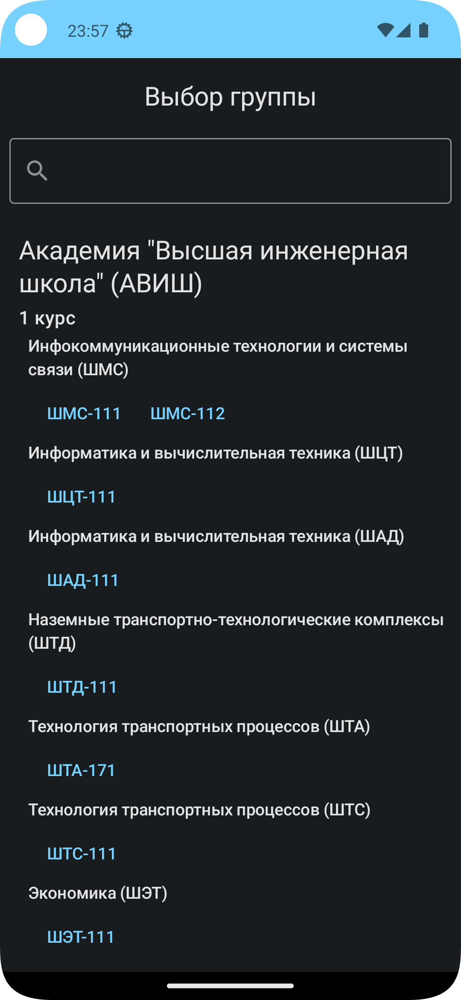
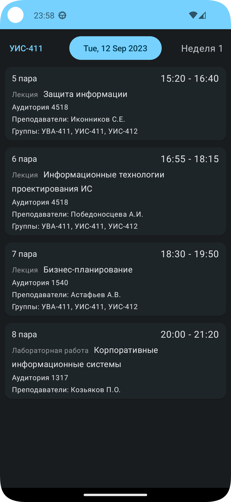

# RUT Schedule

## О приложении
Приложение с расписанием для студентов РУТ (МИИТ).

## Возможности
На текущий момент приложение позволяет:
- Просматривать группы
- Просматривать расписание выбранной группы
- Доступ к расписанию в режиме оффлайн

## Скриншоты

## Лицензия
Приложение распространяется по лицензии MIT (смотрите [LICENSE](LICENSE)).
